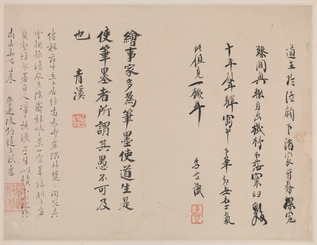

<!-- Headings -->
# Heading 1
## Heading 2
### Heading 3
#### Heading 4
##### Heading 5
###### Heading 6

<!-- Unordered list -->
- Bullet Point 1
- Bullet Point 2
- Bullet Point 3


<!-- Ordered list -->
This is an ordered list:

1. List Item 1
2. List Item 2
3. List Item 3


<!-- Italics -->
*These three words* are italicized.

<!-- Bold -->
The name **Abraham Lincoln** is bolded.

<!-- Strikethrough -->
~~This text~~ uses strikethrough.

```
# Greet user function (Version 1)
def greet_user():
    """Display a simple greeting."""
    print('Good morning!')
```

<!-- Task List -->
* [x] Task 1
* [ ] Task 2
* [x] Task 3

<!-- Tables -->
| Name        | Email             |
| -------     | ----------------  |
| Mike Smith  | smithm@gmail.com  |
| Phil Murray | murrayp@gmail.com |

<!-- Images -->




<!-- Horizontal rule -->
---

<!-- Blockquote -->
> This is an example of a blockquote. Notice how the text is indented slightly.

<!-- Hyperlinks -->
[Amazon](http://www.amazon.com)